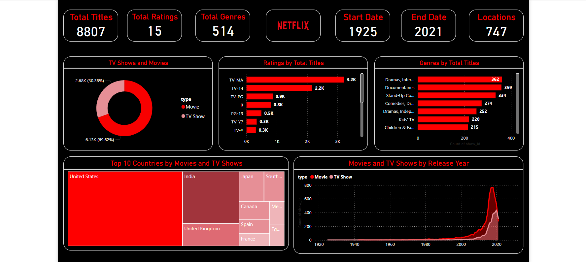

Netflix Dashboard – Interactive Data Insights with Power BI

Overview

The Netflix Dashboard is an interactive Power BI solution designed to analyze Netflix's content library, providing deep insights into the platform’s movies, TV shows, genres, ratings, and global distribution. This dashboard helps users explore trends, understand content distribution, and make data-driven decisions using an engaging and visually appealing interface.
Key Features
📊 Comprehensive Data Visualization

    TV Shows vs. Movies – A donut chart visualizing the proportion of TV shows and movies available on Netflix.
    Ratings Breakdown – A bar chart showcasing the number of titles under different rating categories like TV-MA, TV-14, and PG-13.
    Genre Analysis – A detailed breakdown of the most popular genres by total titles.
    Country-wise Content Distribution – A treemap displaying the top 10 countries producing Netflix content.
    Content Growth Over Time – A line chart tracking the release trend of Netflix titles from 1925 to 2021.

🔄 Data Cleaning & Transformation

    Power Query for ETL – Extracted, cleaned, and structured raw data for seamless analysis.
    Data Preprocessing – Removed inconsistencies, handled missing values, and ensured data accuracy.
    Data Modeling – Established relationships between datasets for enhanced interactivity.

🎨 Sleek & Intuitive UI

    Netflix-Inspired Dark Theme – Modern aesthetics for a clean and immersive experience.
    Interactive Elements – Drill-through filters, slicers, and hover effects for better navigation.
    Optimized for Performance – Efficient data loading and quick response time.

Technology Stack

✅ Power BI – Data visualization & interactive reporting
✅ Power Query – Data transformation & ETL processing
✅ DAX (Data Analysis Expressions) – Custom calculations & aggregations
✅ Data Modeling – Relationship management between tables
✅ Data Cleaning & EDA – Ensuring accuracy and insight extraction
Use Cases

📌 Content Strategists – Identify trends in Netflix’s content offerings.
📌 Data Analysts – Perform deep data exploration for business insights.
📌 Entertainment Industry Professionals – Understand global content distribution.
📌 Market Researchers – Track streaming service growth and audience preferences.
Why This Dashboard?

✅ Instant Insights – No need for manual data crunching.
✅ User-Friendly – Interactive and visually engaging.
✅ Business-Driven – Designed to support data-driven decisions in media analytics.
Get Started 🚀

This Netflix Dashboard is a perfect showcase of Power BI capabilities, demonstrating how data visualization can transform raw data into meaningful insights. Whether you’re a data analyst, a business professional, or a content strategist, this dashboard provides an in-depth look into Netflix’s vast content library.
